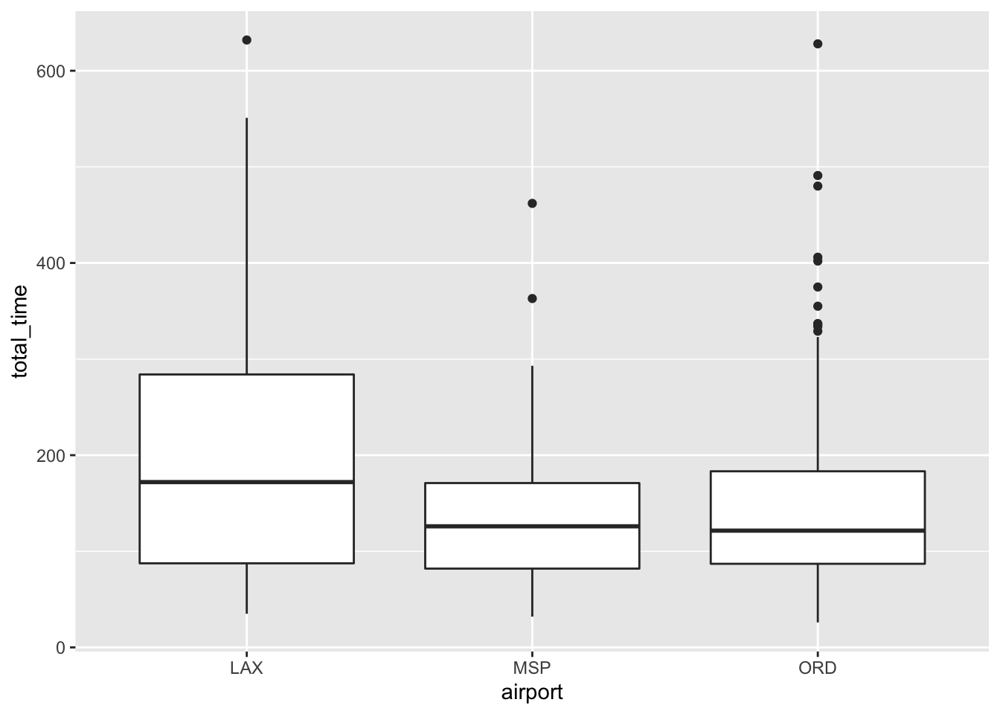
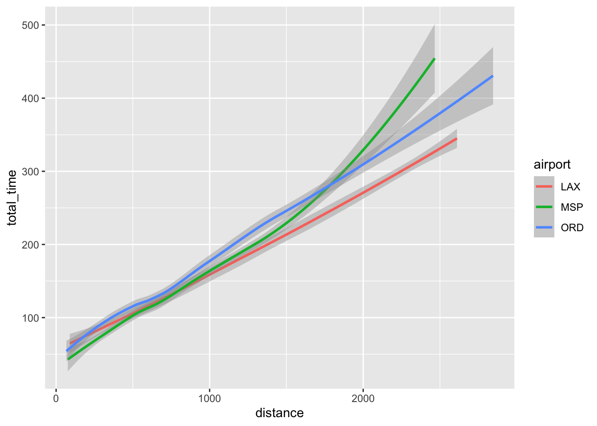
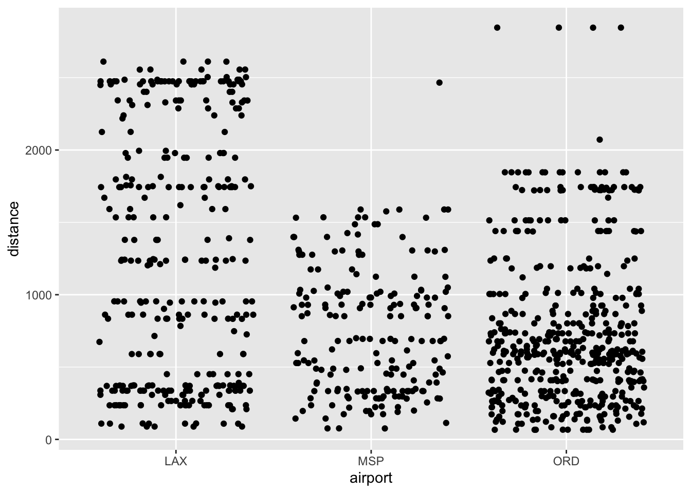
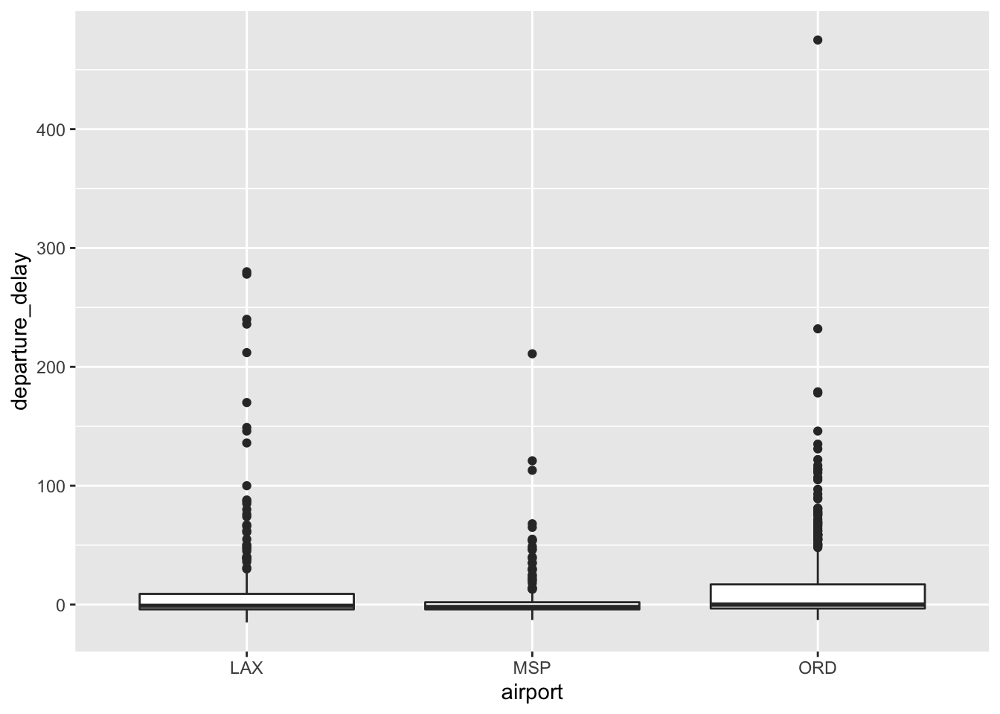
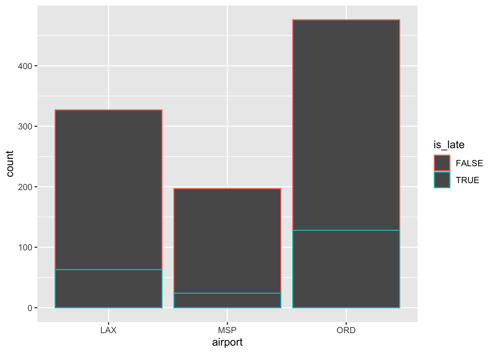

# Review!


## The big picture


\
\


**The bigger picture**

You've learned a powerful set of foundational tools in STAT 155. These will get you far, but not everywhere. Here's where STAT 155 fits into the broader STAT curriculum:    

\


- **COMP/STAT 112: Intro to Data Science**    
    Whereas STAT 155 focuses on statistical *modeling*, STAT 112 dives more deeply into data scraping, wrangling, visualization, and interaction. Not only are these steps required before we can do any modeling, they provide a complementary lens for a more holistic analysis.

    


- **STAT 253: Statistical Machine Learning**    
    Picks up where STAT 155 leaves off, expanding upon our modeling tools for "supervised analyses" (exploring relationships between y and x) while also exploring tools for "unsupervised analyses" (when we just have a bunch of features x and no y).
    

- **Working with other data types**    
    - **STAT 452: Correlated Data**    
        Our STAT 155 models assume that the cases / rows in a dataset are *independent*. This assumption doesn't always hold!Correlated Data explores tools that apply when cases are temporally, spatially, or structurally dependent.    
        
    - **STAT 453: Survival Analysis**    
        Our STAT 155 models assume that $y$ is quantitative or categorical, but not much else.Survival Analysis explores tools that are specialized to exploring "time to event" $y$ variables.
    

- **Working through other lenses**    
    - **STAT 451: Causal Inference**    
        STAT 155 provides tools that allow us to explore *correlation* among variables. It doesn't even attempt to establish *causation*. Causal Inference addresses the big question of "when *does* correlation imply causation?".    
        
    - **STAT 155: Bayesian Statistics**    
        STAT 155 looks at statistical machine learning through a *frequentist* lens. The *Bayesian* philosophy provides an alternative lens. Mainly, we can take our 155 tools and look at them as either Bayesians or frequentists. Simply put, Bayesians formally interpret data in light of their *prior* understanding and ask different questions than frequentists (eg: no p-values!).    


\
\


**You can learn more without taking classes!**    

The following are great ways to continue playing around with data:

- [TidyTuesday](https://github.com/rfordatascience/tidytuesday) posts a new data set each week. There's a broad community that shares their analyses and ideas (#tidytuesday). [David Robinson](https://www.youtube.com/channel/UCeiiqmVK07qhY-wvg3IZiZQ/videos) often posts screencasts demonstrating how he works through the data. 
    
- [Kaggle](https://www.kaggle.com/) hosts a larger data repository and community. Since there are so many datasets, this is a bit more overwhelming than TidyTuesday (my opinion), but still fun.
    
- [Jo Hardin](https://teachdatascience.com/keepbusy/) has a great list of more ideas!


\
\
\
\


## Exercises


**Goals**    

- Bring together some big course *themes* while practicing some details. This is not an exhaustive review for Quiz 3, but is a great start.

- Self-assess and identify the areas where you're a bit rusty (thus where you might spend more time reviewing).

- You can skip around and over as you see fit for your own review purposes. There are a _lot_ of questions - this is not designed to plow through in one sitting.


\
\


**Getting started**


```r
# Load packages
library(ggplot2)
library(dplyr)
```

```
## 
## Attaching package: 'dplyr'
```

```
## The following objects are masked from 'package:stats':
## 
##     filter, lag
```

```
## The following objects are masked from 'package:base':
## 
##     intersect, setdiff, setequal, union
```

```r
library(magrittr)

# Import data on flights
flights <- read.csv("https://www.macalester.edu/~ajohns24/data/flights_small.csv") %>% 
  mutate(day_of_week = as.factor(day_of_week), month = as.factor(month))
```


\
\


**Data story**    

In the exercises below, you'll be studying trends in flights leaving from three different airports: LAX (Los Angeles), MSP (Minneapolis-St Paul), and ORD (Chicago O'Hare). This is a subset of data originally posted on kaggle: https://www.kaggle.com/usdot/flight-delays#flights.csv


\
\


## Exercise 1: Open ended: Get to know the data

Before we do any modeling or analysis, take a few moments to familiarize yourself with the data. (What kinds of things are you looking at here?)
    
When and where are flights originating, are they early/late in the day, on a Thursday?
    
\
\


## Exercise 2: total_time vs airport: open-ended

The `total_time` variable measures the total time of a flight experience in minutes, *including* delays, time in the air, and time sitting in the plane on the ground. One point of interest is how the `total_time` of a flight (in minutes) might vary by the `airport` from which it departs, in our sample data and beyond. Take a basic first attempt at exploring this relationship. Since the whole point of this activity is to help you review, *you* get to determine how deep you want to go here. The goals here are to:    

- practice identifying which visualization, numerical summary, and modeling tools are appropriate here; and

- build your comfort level in working in the open-ended settings which are common outside the classroom environment. 


```r
small_flights <- flights %>%
  select(total_time, airport, distance)
```
    
    
\
\


## Exercise 3: total_time vs airport: directed exploratory analysis

Let's consider the relationship between `total_time` and `airport` through some directed questions. (You might have already taken some of these steps above.)
    
a. .    

```r
small_flights %>%
  group_by(airport) %>%
  summarise(mean(total_time))
```

```
## # A tibble: 3 x 2
##   airport `mean(total_time)`
## * <chr>                <dbl>
## 1 LAX                   188.
## 2 MSP                   131.
## 3 ORD                   144.
```

```r
small_flights %>%
  ggplot(aes(x = airport, y = total_time)) +
  geom_boxplot()
```



```r
airport_time_model <- lm(total_time ~ airport, small_flights)
summary(airport_time_model)$coef
```

```
##              Estimate Std. Error   t value      Pr(>|t|)
## (Intercept) 188.46789   4.715848 39.964792 3.003556e-209
## airportMSP  -57.05672   7.691169 -7.418472  2.531541e-13
## airportORD  -44.24520   6.125113 -7.223573  1.004667e-12
```

b. Interpret each value in the estimate column.

The average LAX total flight time is about 3 hours, where as MSP and ORD have 60 and 45 minute lower average total times.

c. On average, which airport has the longest total_time? The shortest?
    
LAX & MSP


\
\


## Exercise 4: total_time vs airport: directed inferential analysis I


a. Interpret the standard error in the `airportORD` row.
About 68% of flights take between 38 and 50 minutes less total time than an average flight from LAX.

b. Using the Central Limit Theorem and information in the model summary table, sketch the sampling distribution for $\hat{\beta}_2$, possible estimates of the true `airportORD` coefficient $\beta_2$. Interpret what the sampling distribution tells us.


c. Construct and interpret a 95% CI for $\beta_2$ using the 68-95-99.7 Rule. Check your work using `confint()`.    

```r
c( -44.24520 - 2 * 6.125113,  -44.24520 + 2 * 6.125113 )
```

```
## [1] -56.49543 -31.99497
```

```r
confint(airport_time_model)
```

```
##                 2.5 %    97.5 %
## (Intercept) 179.21376 197.72202
## airportMSP  -72.14946 -41.96399
## airportORD  -56.26479 -32.22561
```

    

    

\
\


## Exercise 5: total_time vs airport: directed inferential analysis II

For the `airportORD` coefficient $\beta_2$, let's test the hypothesis that $\beta_2 < 0$.

a. In words and the context of this model, interpret the meaning of this hypothesis.    
We are testing that ORD has a lower average total flight time.

b. Report and interpret the `t value` for this test.       
-7.223573

c. Report and interpret the p-value for this test.    

```r
1.004667e-12/2
```

```
## [1] 5.023335e-13
```


d. Based on this work, what conclusion do you make about the hypothesis test? Is it statistically significant? Practically significant?    
It is both practically and statistically significant.

e. What type of error might you be making?    
Type I (false positive)


\
\


## Exercise 6: total_time vs airport & distance: open-ended    

Of course, a flight's `distance` is also a factor in `total_time`. Thus in exploring how the `total_time` of a flight (in minutes) might vary by the `airport` from which it departs, we should control for this factor. Take a basic first attempt at exploring the relationship among these three variables. Again, *you* get to determine how deep you want to go here.


```r
airport_model_2 <- lm(total_time ~ airport + distance, small_flights)
summary(airport_model_2)$coef
```

```
##               Estimate  Std. Error    t value     Pr(>|t|)
## (Intercept) 41.4710648 3.239919801 12.8000282 7.724212e-35
## airportMSP   2.0875328 3.664848656  0.5696096 5.690710e-01
## airportORD  15.4945330 2.980072890  5.1993805 2.426129e-07
## distance     0.1183471 0.001939042 61.0337820 0.000000e+00
```


\
\


## Exercise 7: total_time vs airport & distance: directed exploratory analysis I

Let's consider the relationship of `total_time` with `airport` and `distance` through some directed questions. (You might have already taken some of these steps above.)

a. Visualize the relationship between total_time, airport, and distance.    

```r
small_flights %>%
  ggplot(aes(x = distance, y = total_time, color = airport)) +
  geom_smooth()
```

```
## `geom_smooth()` using method = 'loess' and formula 'y ~ x'
```




b. Model the relationship WITH an interaction term. Write out formulas of `total_time` vs `distance` for each of the 3 airports.

```r
airport_model_3 <- lm(total_time ~ airport * distance, small_flights)
summary(airport_model_3)$coef
```

```
##                         Estimate  Std. Error    t value      Pr(>|t|)
## (Intercept)          50.95281822 3.767471304 13.5244078  2.222088e-38
## airportMSP          -16.93389172 6.635741222 -2.5519217  1.086172e-02
## airportORD           -1.77811954 4.865775631 -0.3654339  7.148653e-01
## distance              0.11071331 0.002493818 44.3950992 3.997793e-238
## airportMSP:distance   0.02048474 0.006820176  3.0035498  2.735328e-03
## airportORD:distance   0.01820058 0.004224879  4.3079521  1.811280e-05
```


c. Explain what the *signs* (+ or -) of the `distance`, `airportMSP:distance`, and `airportORD:distance` coefficients indicate about the relationships of interest.
The positive sign on distance means that as the flight distance goes up, generally the total time also increases. The positive interaction terms mean that the other airports have a greater increase in time per mile than LAX.

d. Notice that the interaction coefficients are statistically significant. Are they practically significant?
They are statistically significant.

The distances range into thousands of miles, and for these values, MSP is on average 20 minutes slower per 1000 miles, ORD is 18 minutes slower on average. These are practically significant.


\
\


## Exercise 8: total_time vs airport & distance: directed inferential analysis I    

a. Model the relationship WITHOUT an interaction term. Report the model summary table.

```r
summary(airport_model_2)$coef
```

```
##               Estimate  Std. Error    t value     Pr(>|t|)
## (Intercept) 41.4710648 3.239919801 12.8000282 7.724212e-35
## airportMSP   2.0875328 3.664848656  0.5696096 5.690710e-01
## airportORD  15.4945330 2.980072890  5.1993805 2.426129e-07
## distance     0.1183471 0.001939042 61.0337820 0.000000e+00
```


b. Interpret the `airportORD` and `distance` coefficients.
For each mile, the total time increases by about 7 seconds, and on average ORD takes about 15.5 minutes longer controlling for distance compared to a flight out of LAX.

c. Report and interpret the R-squared of this model.

```r
summary(airport_model_2)
```

```
## 
## Call:
## lm(formula = total_time ~ airport + distance, data = small_flights)
## 
## Residuals:
##    Min     1Q Median     3Q    Max 
## -54.38 -20.28  -8.87   5.97 452.10 
## 
## Coefficients:
##              Estimate Std. Error t value Pr(>|t|)    
## (Intercept) 41.471065   3.239920  12.800  < 2e-16 ***
## airportMSP   2.087533   3.664849   0.570    0.569    
## airportORD  15.494533   2.980073   5.199 2.43e-07 ***
## distance     0.118347   0.001939  61.034  < 2e-16 ***
## ---
## Signif. codes:  0 '***' 0.001 '**' 0.01 '*' 0.05 '.' 0.1 ' ' 1
## 
## Residual standard error: 39.19 on 996 degrees of freedom
## Multiple R-squared:  0.8034,	Adjusted R-squared:  0.8028 
## F-statistic:  1357 on 3 and 996 DF,  p-value: < 2.2e-16
```

```r
0.8034
```

```
## [1] 0.8034
```

This is a reasonably tight fit, but not excellent.

d. Considering this model alongside that without a `distance` predictor, how did controlling for `distance` change / enhance our understanding of the flights leaving from ORD?
Controlling for distance, we see that flights leaving ORD tend to run 15 minutes slower than those from LAX (or even MSP).


\
\


## Exercise 9: total_time vs airport & distance: directed inferential analysis II


For further practice, suppose we were to test $H_0: \beta_1 = 0$ vs $H_a: \beta_1 > 0$ where $\beta_1$ is the actual `airportMSP` coefficient.    

a. Interpret the meaning of $H_0$ in this context.
We are testing if the average total flight time for MSP is longer than LAX (controlling for dist?).

b. Using the Central Limit Theorem and information in the model summary table, sketch the sampling distribution for $\hat{\beta}_1$, possible estimates of $\beta_1$ that we'd expect if $H_0$ were true. Indicate the range on the x-axis.


c. Mark our sample estimate on your sketch.


d. Use the 68-95-99.7 Rule to approximate the p-value for this test: less than 0.0015, between 0.0015 & 0.025, between 0.025 & 0.16, or greater than 0.16.
    
greater than 0.16


\
\


## Exercise 10: Prediction intervals

a. Your neighbor is flying out of MSP tomorrow on a 1000 mile flight. Compute a interpret a 95% prediction interval for their total flight experience.


```r
predict(airport_model_3, newdata=data.frame(airport = "MSP", distance = 1000), interval = "predict", level = 0.95)
```

```
##       fit      lwr      upr
## 1 165.217 88.85559 241.5784
```


b. Compute a interpret a 95% confidence interval for the *typical* total flight experience for all 1000 mile flights leaving from MSP.


```r
predict(airport_model_3, newdata=data.frame(airport = "MSP", distance = 1000), interval = "confidence", level = 0.95)
```

```
##       fit      lwr      upr
## 1 165.217 158.9162 171.5178
```


\
\


    
## Exercise 11: Last question on this model

a. If we had to pick just *one* predictor, which is the better predictor of `total_time`, `airport` or `distance`?    
`distance`

b. Are `airport` and `distance` multicollinear predictors? Provide some evidence, either visual or numerical.
Nope.

```r
small_flights %>%
  ggplot(aes(x = airport, y = distance)) +
  geom_jitter()
```


        

\
\


## Exercise 12: Running late


```r
# Plot departure_delay (the number of minutes late or early a flight leaves)
flights %>%
  ggplot(aes(x = airport, y = departure_delay)) +
  geom_boxplot()
```



```r
# Define a new variable, is_late, which indicates  
# whether a flight leaves at least 15 minutes late (>= 15)
flights %<>%
  mutate(is_late = departure_delay >= 15)

# Plot is_late
flights %>%
  ggplot(aes(x = airport, color = is_late)) +
  geom_bar()
```



```r
# Challenge: Calculate the observed chance of late flights on each day of the week
flights %>%
  group_by(day_of_week) %>%
  summarize(mean(is_late))
```

```
## # A tibble: 7 x 2
##   day_of_week `mean(is_late)`
## * <fct>                 <dbl>
## 1 1                     0.204
## 2 2                     0.227
## 3 3                     0.253
## 4 4                     0.192
## 5 5                     0.231
## 6 6                     0.152
## 7 7                     0.238
```
    

\
\


## Exercise 13: Modeling the chances of being late: open-ended  

So what exactly is associated with an increase risk of a flight being late? Take a basic first attempt at exploring the relationship of `is_late` with: `airport`, `distance`, `day_of_week`, `month`, and `late_night_departure` (whether the flight leaves between 10pm and 6am). Again, you get to determine how deep you want to go here.


```r
airport_model_4 <- glm(is_late ~ airport + distance + day_of_week + month + late_night_departure, flights, family="binomial")
summary(airport_model_4)
```

```
## 
## Call:
## glm(formula = is_late ~ airport + distance + day_of_week + month + 
##     late_night_departure, family = "binomial", data = flights)
## 
## Deviance Residuals: 
##     Min       1Q   Median       3Q      Max  
## -1.1061  -0.7492  -0.5788  -0.3252   2.4754  
## 
## Coefficients:
##                            Estimate Std. Error z value Pr(>|z|)    
## (Intercept)              -1.381e+00  3.659e-01  -3.775  0.00016 ***
## airportMSP               -5.587e-01  2.718e-01  -2.055  0.03984 *  
## airportORD                4.295e-01  1.893e-01   2.269  0.02329 *  
## distance                 -7.683e-06  1.257e-04  -0.061  0.95126    
## day_of_week2              1.524e-01  3.216e-01   0.474  0.63567    
## day_of_week3              2.419e-01  2.898e-01   0.835  0.40390    
## day_of_week4             -1.030e-01  2.977e-01  -0.346  0.72928    
## day_of_week5              2.151e-01  2.941e-01   0.731  0.46452    
## day_of_week6             -3.761e-01  3.374e-01  -1.115  0.26491    
## day_of_week7              2.047e-01  3.007e-01   0.681  0.49595    
## month2                    3.444e-01  3.435e-01   1.003  0.31605    
## month3                    9.419e-02  3.373e-01   0.279  0.78005    
## month4                   -5.566e-01  3.854e-01  -1.444  0.14868    
## month5                    1.534e-01  3.402e-01   0.451  0.65197    
## month6                    5.418e-01  3.412e-01   1.588  0.11228    
## month7                   -2.516e-01  3.703e-01  -0.679  0.49689    
## month8                    9.517e-02  3.363e-01   0.283  0.77717    
## month9                   -9.703e-01  4.128e-01  -2.350  0.01875 *  
## month11                  -1.214e+00  4.630e-01  -2.623  0.00872 ** 
## month12                  -3.204e-02  3.436e-01  -0.093  0.92571    
## late_night_departureTRUE -9.354e-01  7.822e-01  -1.196  0.23175    
## ---
## Signif. codes:  0 '***' 0.001 '**' 0.01 '*' 0.05 '.' 0.1 ' ' 1
## 
## (Dispersion parameter for binomial family taken to be 1)
## 
##     Null deviance: 1041.01  on 999  degrees of freedom
## Residual deviance:  980.52  on 979  degrees of freedom
## AIC: 1022.5
## 
## Number of Fisher Scoring iterations: 5
```


\
\


## Exercise 14: Modeling the chances of being late: directed analysis

a. Construct a model of `is_late` by `airport`, `distance`, `day_of_week`, `month`, and `late_night_departure` (whether the flight leaves between 10pm and 6am). Report the model summary table.

```r
airport_model_5 <- glm(is_late ~ airport * distance + day_of_week + month + late_night_departure, flights, family="binomial")
summary(airport_model_5)
```

```
## 
## Call:
## glm(formula = is_late ~ airport * distance + day_of_week + month + 
##     late_night_departure, family = "binomial", data = flights)
## 
## Deviance Residuals: 
##     Min       1Q   Median       3Q      Max  
## -1.1106  -0.7574  -0.5781  -0.3306   2.5094  
## 
## Coefficients:
##                            Estimate Std. Error z value Pr(>|z|)    
## (Intercept)              -1.328e+00  3.930e-01  -3.379 0.000728 ***
## airportMSP               -7.674e-01  5.101e-01  -1.504 0.132490    
## airportORD                3.628e-01  3.134e-01   1.158 0.246958    
## distance                 -4.768e-05  1.684e-04  -0.283 0.777016    
## day_of_week2              1.480e-01  3.217e-01   0.460 0.645485    
## day_of_week3              2.447e-01  2.900e-01   0.844 0.398646    
## day_of_week4             -1.024e-01  2.978e-01  -0.344 0.730888    
## day_of_week5              2.179e-01  2.943e-01   0.740 0.459176    
## day_of_week6             -3.773e-01  3.375e-01  -1.118 0.263729    
## day_of_week7              2.024e-01  3.010e-01   0.672 0.501384    
## month2                    3.317e-01  3.445e-01   0.963 0.335678    
## month3                    8.222e-02  3.383e-01   0.243 0.807986    
## month4                   -5.583e-01  3.857e-01  -1.447 0.147776    
## month5                    1.455e-01  3.407e-01   0.427 0.669331    
## month6                    5.415e-01  3.414e-01   1.586 0.112689    
## month7                   -2.540e-01  3.705e-01  -0.685 0.493058    
## month8                    8.951e-02  3.367e-01   0.266 0.790355    
## month9                   -9.740e-01  4.130e-01  -2.358 0.018365 *  
## month11                  -1.214e+00  4.632e-01  -2.622 0.008746 ** 
## month12                  -3.220e-02  3.442e-01  -0.094 0.925453    
## late_night_departureTRUE -9.336e-01  7.828e-01  -1.193 0.233034    
## airportMSP:distance       2.483e-04  5.196e-04   0.478 0.632735    
## airportORD:distance       6.346e-05  2.657e-04   0.239 0.811237    
## ---
## Signif. codes:  0 '***' 0.001 '**' 0.01 '*' 0.05 '.' 0.1 ' ' 1
## 
## (Dispersion parameter for binomial family taken to be 1)
## 
##     Null deviance: 1041.01  on 999  degrees of freedom
## Residual deviance:  980.28  on 977  degrees of freedom
## AIC: 1026.3
## 
## Number of Fisher Scoring iterations: 5
```


b. Controlling for distance, what is the ideal airport, day of week, month, and time of day for a flight (presuming one doesn't want to be late)?
from MSP, late at night on a Saturday in September

c. Suppose somebody is taking a 1000 mile flight out of MSP on a Monday afternoon (day 1) in March (month 3). What's the probability their flight will be late?


```r
predict(airport_model_5, newdata=data.frame(airport = "MSP", distance = 1000, day_of_week="1", month="3", late_night_departure=FALSE), interval = "predict", level = 0.95, type="response")
```

```
##         1 
## 0.1403385
```
    

\
\


## Exercise 15: Modeling the chances of being late: last questions


a. Interpret the `distance` coefficient (not on the log scale).


```r
exp(-4.768e-05) ^ 1000
```

```
## [1] 0.9534388
```

Each 1000 miles decreases the odds of lateness by 5%.

b. Interpret the `airportORD` coefficient (not on the log scale).

```r
exp(3.628e-01)
```

```
## [1] 1.437348
```

Flying from ORD increases the odds of lateness by 43%.

c. Do a quick check of the p-values associated with these two predictors. Summarize your conclusions.

    
\
\


## Exercise 16: Choose your own adventure

There are a lot of other features to consider in this dataset. Explore some!


\
\
\
\


